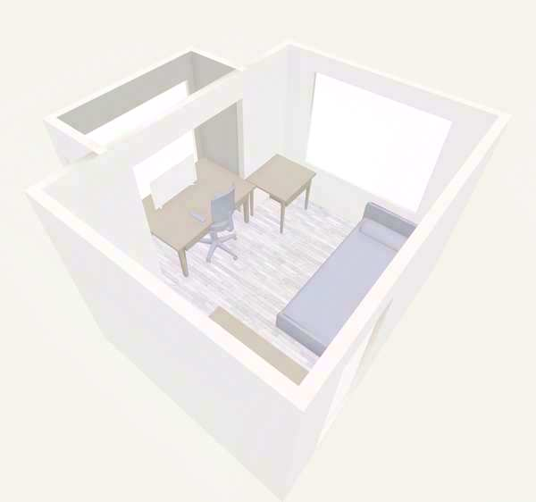
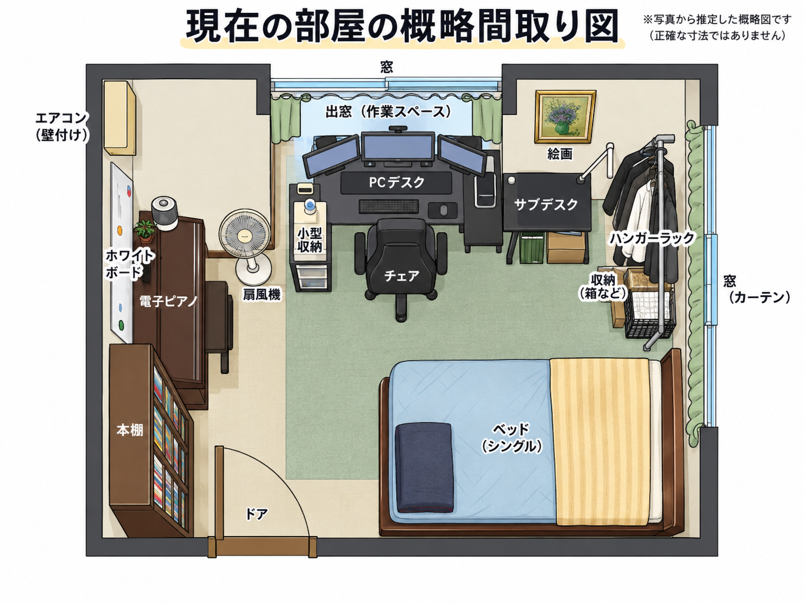
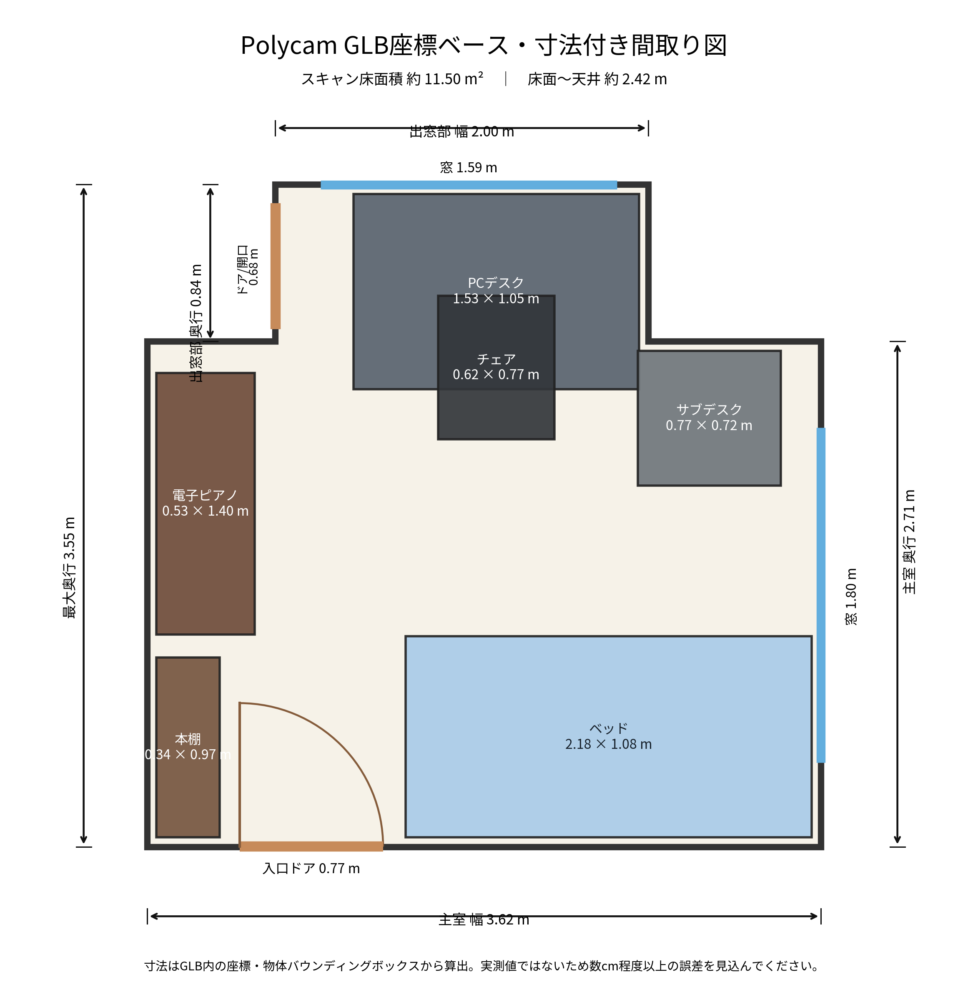

# 3Dスキャンで部屋を記録し、間取り図にする検証

スマートフォンで部屋を3Dスキャンし、そのデータと写真をAIで整理して、**部屋の形・家具の配置・おおよその寸法を分かりやすく残せるか**を試した記録です。

### 3Dスキャンした部屋

### AIで見やすく整理した現在の部屋

実際の部屋を3Dで記録しておくことで、将来の引っ越しや新居探しのときに、

- 今ある家具を新居に置けるか
- ベッドや机をどこに配置するか
- 大型家具を玄関や廊下から搬入できるか
- コンセントやLANの位置を考えて在宅勤務環境を作れるか

といったことを、写真や記憶だけではなく**実際の空間データをもとに検討する**ことを目指しています。

## 今回やったこと

1. **Polycamで現在の部屋を3Dスキャン**
2. **部屋の写真もあわせて記録**
3. **ChatGPTで3Dデータを解析**
4. **現在の家具配置が分かる間取り図を作成**
5. **部屋や家具のおおよその寸法を入れた間取り図を作成**

### 3Dデータから作成した寸法付き間取り図

## 3Dスキャンから分かった主なサイズ

| 場所・家具 | おおよそのサイズ |
|---|---:|
| 部屋のメイン部分 | 約 3.62 × 2.71 m |
| 出窓・作業スペース | 約 2.00 × 0.84 m |
| 部屋の最大奥行 | 約 3.55 m |
| 床面積 | 約 11.50 m² |
| 床から天井まで | 約 2.42 m |
| ベッド | 約 2.18 × 1.08 m |
| PCデスク周辺 | 約 1.53 × 1.05 m |
| サブデスク | 約 0.77 × 0.72 m |
| 電子ピアノ | 約 0.53 × 1.40 m |
| 本棚 | 約 0.34 × 0.97 m |
| 入口ドアの幅 | 約 0.77 m |
| 出窓側の窓 | 約 1.59 m |
| 右側の窓 | 約 1.80 m |

## 新居用に検討している家具

2026-09-13 にニトリで実物を見て、現時点では次の2点を候補にしています。まだ購入確定ではなく、新居の間取りや搬入経路と合わせて最終判断する予定です。

### ソファ

**[3人掛けソファ 本革（一部合成皮革）タイプ（DL01 BE）](https://www.nitori-net.jp/ec/product/2110300032330/)**

- ベージュ
- 3人掛け
- 本革（一部合成皮革）
- サイズ：幅190 × 奥行95 × 高さ93cm
- 重量：約61.5kg
- 背もたれを外すことで、納品間口55cmまで搬入可能
- 新居のリビングでのサイズ感、テレビとの距離、搬入可否を確認予定

### ダイニングテーブル

**[ダイニングテーブル（OM004 120 WW/WH）](https://www.nitori-net.jp/ec/product/2110100020544)**

- 幅120cmクラス
- WW/WH
- 椅子を引くスペースや、ソファと同時に置いたときの動線を確認予定

家具候補の詳細と確認ポイントは [`docs/furniture-candidates.md`](docs/furniture-candidates.md) にまとめています。

## この方法で今後できそうなこと

今回の検証を引っ越しや新居の内見時にも使えば、次のようなことができます。

- **家具の引っ越し判定**：今のベッド、本棚、机などが新居に入るか確認する
- **新しく買う家具の配置確認**：購入候補のソファやダイニングテーブルを新居の間取りに置いて比較する
- **家具配置の比較**：レイアウト案をA/B/Cのように複数作って比較する
- **搬入経路の確認**：玄関、廊下、ドア、エレベーターを家具が通れるか確認する
- **収納量の比較**：今の収納量と新居のクローゼットなどを比べる
- **在宅勤務環境の設計**：机、モニター、コンセント、LAN、Wi-Fiの位置をまとめて考える
- **ロボット掃除機の動線確認**：家具の脚や床の段差を見ながら掃除しやすい配置を考える
- **引っ越し前後の比較**：旧居と新居を同じ形式で記録し、何を持っていくか整理する

より詳しいアイデアは [`docs/future-use-cases.md`](docs/future-use-cases.md) にまとめています。

## このリポジトリに入っているもの

| ファイル | 内容 |
|---|---|
| `assets/room-scan-preview.jpg` | 3Dスキャンした部屋のプレビュー画像 |
| `data/room-scan.glb` | Polycamから書き出した部屋の3Dデータ本体 |
| `outputs/current-room-overview.png` | 現在の家具配置が分かるカラーの間取り図 |
| `outputs/dimensioned-floorplan.png` | 部屋や家具の寸法を入れた間取り図 |
| `outputs/dimensioned-floorplan.pdf` | 寸法付き間取り図のPDF版 |
| `analysis/measurements.yaml` | 3Dデータから読み取った寸法を一覧化したデータ |
| `docs/future-use-cases.md` | 引っ越し・新居探しでの活用アイデア |
| `docs/furniture-candidates.md` | 新居用に検討している家具と確認ポイント |
| `data/furniture-candidates.yaml` | 家具候補を後で比較しやすい形にしたデータ |

## 元の3Dスキャン

Polycamで取得したデータです。

- [Polycamで3Dスキャンを見る](https://poly.cam/capture/A563F82A-8B22-46D5-BE74-9D4EBC7DAFCD)
- GitHub内の3Dデータ：[`data/room-scan.glb`](data/room-scan.glb)

## 注意点

ここに記載している寸法は、**3Dスキャンから読み取った推定値**です。引っ越しの検討や家具配置の比較には使えますが、数cmの違いが重要になる場面では実測が必要です。

特に、冷蔵庫・洗濯機・大型家具の搬入、カーテン購入、収納家具の購入などでは、メジャーやレーザー距離計で最終確認することを前提としています。

また、このリポジトリは公開されているため、3Dデータには実際の室内形状や家具配置が含まれている点に注意してください。
