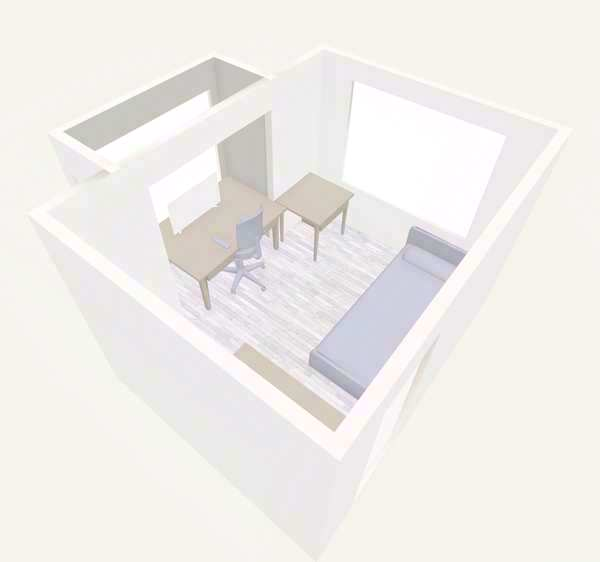

# 3D Room Scan and Floor Plan

[English](README.md) | [日本語](README.ja.md)

An experiment using smartphone 3D scans, room photos, and AI analysis to document room shape, furniture placement, and approximate dimensions for moving and layout planning.

## Workflow

1. Capture a room with Polycam and take supporting photos.
2. Analyze the scan and photos with AI.
3. Produce an overview floor plan showing furniture.
4. Add approximate room and furniture dimensions.

The goal is to support furniture placement, moving-access checks, and home-office layout planning. Dimensions derived from scans are approximate; consult the Japanese record for the observations and limitations.

## Contents

- [docs/](docs)
- [homes/](homes)

## Detailed documentation

The [Japanese guide](README.ja.md) retains the complete original setup instructions, configuration, examples, project status, and limitations. Supporting documents keep their existing language.
