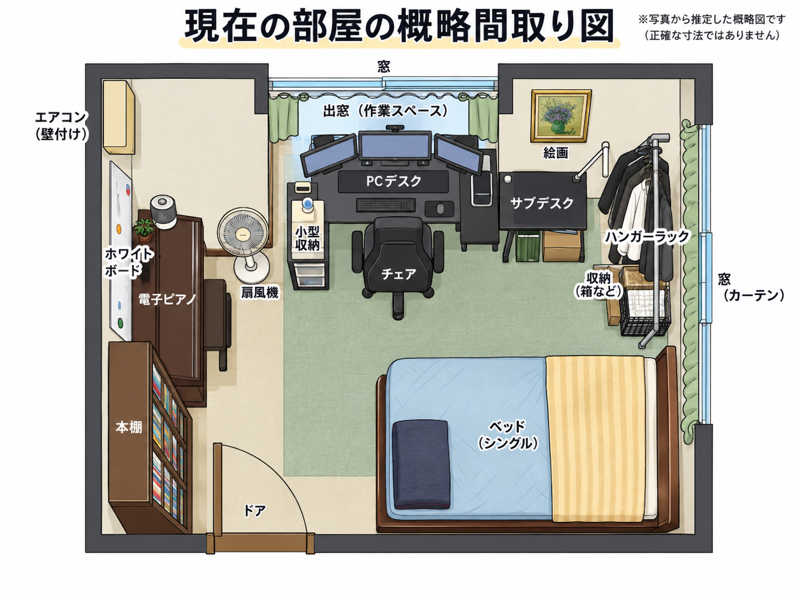
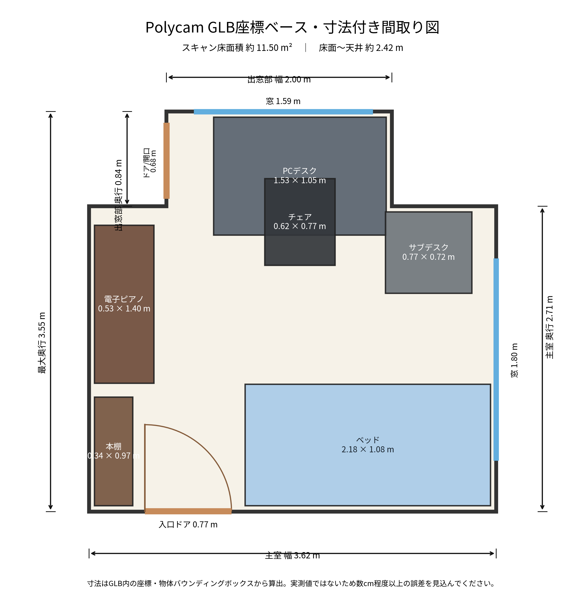

# 家1（現在の住まい）

最初にスキャン・記録した部屋。新居（[家2](../home2/README.md)）と比較するときの基準データです。

| ファイル | 内容 |
|---|---|
| `assets/room-scan-preview.jpg` | 3Dスキャンのプレビュー画像 |
| `data/room-scan.glb` | Polycamの3Dデータ本体 |
| `data/room-scan-reference.md` | 3Dデータの説明 |
| `outputs/` | 間取り図（PNG / SVG / PDF） |
| `analysis/measurements.yaml` | 3Dデータから読み取った寸法 |

Polycam: https://poly.cam/capture/A563F82A-8B22-46D5-BE74-9D4EBC7DAFCD

寸法は3Dスキャンからの推定値です。購入・搬入の最終判断は実測を優先します。
